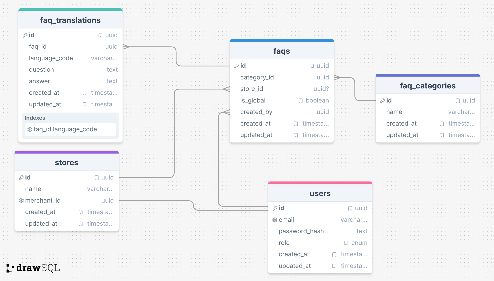
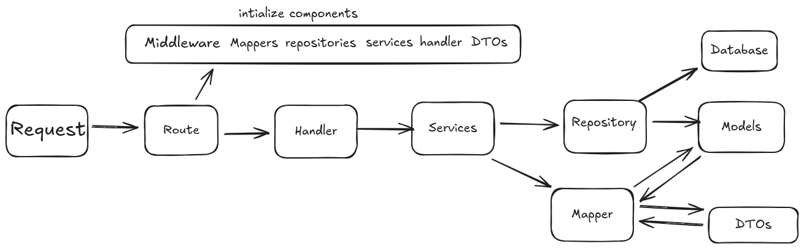

# Yamm – FAQ Management System (Backend)

A scalable FAQ Management System built with Go (Gin) following Clean Architecture principles. The system supports multi-role access (Admin, Merchant, User), multi-language FAQs, and store-specific/global FAQs.

## Features

- JWT-based authentication & authorization
- Role-based access control (Admin / Merchant / User)
- Global & store-specific FAQs
- FAQ categories & translations
- Clean Architecture (Handlers, Services, Repositories, Mappers)
- Middleware-driven request lifecycle
- Database migrations & seed scripts
- Ready for Docker & Docker Compose

## DataBase ERD


## Database Tables

| Table                | Columns                                     |
| -------------------- | ------------------------------------------- |
| **users**            | id, name, email, password, role, created_at |
| **stores**           | id, user_id, name, created_at               |
| **faq_categories**   | id, name                                    |
| **faqs**             | id, question, answer, category_id, store_id |
| **faq_translations** | id, faq_id, language, question, answer     

## Project Structure

```
.
├── cmd
│   └── server
│       └── main.go          # Application entry point
├── internal
│   ├── auth                 # JWT utilities
│   ├── config               # Environment & config loading
│   ├── database             # Database connection
│   ├── dto                  # Request/Response DTOs
│   ├── handlers             # HTTP handlers (controllers)
│   ├── mapper               # Model ↔ DTO mappers
│   ├── middleware           # Auth, role, logging, recovery
│   ├── models               # GORM database models
│   ├── repositories         # Data access layer
│   ├── routes               # API routing
│   └── services             # Business logic
├── migrations
│   └── 20260107181156_initialize_schema.sql
├── scripts
│   ├── schema.sql
│   ├── seed_admin.go
│   └── verify_logic.go
├── ERD.png                  # Database ER diagram
├── go.mod
├── go.sum
└── README.md
```

## Architecture Overview


the application follows Layered Architecture: where each layer has a specific responsibility and communicates with adjacent layers only.
```
Request
    ↓
Middleware
    ↓
Handler (Controller)
    ↓
Service (Business Logic)
    ↓
Mapper (DTO ↔ Model)
    ↓
Repository (DB Access)
    ↓
Database
```

**Benefits:**

- Loose coupling
- Testability
- Clear separation of concerns

## Running the Backend (Local)

### Prerequisites

- Go >= 1.24
- PostgreSQL
- Docker & Docker Compose 

### Environment Variables

Create a `.env` file:

```env
DB_NAME=yamm_faq
SERVER_PORT=9000
GIN_MODE=debug
DB_HOST=postgres
DB_PASSWORD=dbpassword
ADMIN_EMAIL=admin@gmail.com
ADMIN_PASSWORD=adminpassword
JWT_SECRET=test-key
JWT_EXPIRATION_TIME=3600
```

## Docker

Prerequisites: create a `.env` file (see "Environment Variables" above or from `.env.example`) with your DB and server settings and Admin credentials.

Building and running with Docker Compose
-------------------------------

```bash
docker-compose up --build
```

Seeding an admin user
---------------------

```bash
docker run --rm -v "$PWD":/app -w /app --network Yamm-FAQ-Management-Task_app-network \
  -e DB_HOST=postgres -e DB_NAME=$DB_NAME -e DB_PASSWORD=$DB_PASSWORD golang:1.24 \
  go run scripts/seed_admin.go
```

## Authentication

JWT-based authentication. Token must be sent in headers:

```
Authorization: Bearer <JWT_TOKEN>
```

## API Endpoints

### Auth

#### Register

```http
POST /api/auth/register
```


**Request:**

```json
{
  "email": "merchant@example.com",
  "password": "password123",
  "role": "merchant"
}
```
Note: The role can be either "customer" or "merchant". The "admin" role cannot be registered via this endpoint.

**Response:**

```json
{
  "token": "jwt-token",
  "user": {
    "id": "uuid",
    "email": "merchant@example.com",
    "role": "merchant"
  }
}
```

#### Login

```http
POST /api/auth/login
```

**Request:**

```json
{
  "email": "merchant@example.com",
  "password": "password123"
}
```

**Response:**

```json
{
  "token": "jwt-token"
}
```

### Public APIs

#### Get All FAQs

```http
GET /api/faqs
```

**Response:**

```json
[
  {
    "id": "uuid",
    "category_id": "uuid",
    "is_global": true,
    "store_id": null,
    "translations": []
  }
]
```

#### Get FAQ by ID

```http
GET /api/faqs/:id
```

#### Get Categories

```http
GET /api/categories
```

**Response:**

```json
[
  {
    "id": "uuid",
    "name": "General",
    "faqs": []
  }
]
```

#### Get Category by ID

```http
GET /api/categories/:id
```

#### Get FAQ Translations

```http
GET /api/faqs/:id/translations
```

### Protected APIs (JWT Required)

#### User

**Get Current User:**

```http
GET /api/users/me
```

**Delete User:**

```http
DELETE /api/users/:id
```

#### Merchant (Role: merchant)

**Get My Store:**

```http
GET /api/stores/me
```

**Update My Store:**

```http
PUT /api/stores/me
```

**Request:**

```json
{
  "name": "My New Store Name",
  "merchant_id": "uuid"
}
```

**Create FAQ:**

```http
POST /api/merchant/faqs
```

**Request:**

```json
{
  "category_id": "uuid",
  "is_global": false,
  "store_id": "uuid"
}
```

**Update FAQ:**

```http
PUT /api/merchant/faqs/:id
```

**Delete FAQ:**

```http
DELETE /api/merchant/faqs/:id
```

**Add Translation:**

```http
POST /api/merchant/faqs/translations
```

**Request:**

```json
{
  "faq_id": "uuid",
  "language": "en",
  "question": "Question?",
  "answer": "Answer."
}
```

**Update Translation:**

```http
PUT /api/merchant/faqs/translations/:id
```

**Delete Translation:**

```http
DELETE /api/merchant/faqs/translations/:id
```

#### Admin (Role: admin)

**Manage Categories:**

```http
POST /api/admin/categories
PUT /api/admin/categories/:id
DELETE /api/admin/categories/:id
```

**Manage Global FAQs:**

```http
POST /api/admin/faqs
PUT /api/admin/faqs/:id
DELETE /api/admin/faqs/:id
```

**Manage Translations:**

```http
POST /api/admin/translations
PUT /api/admin/translations/:id
DELETE /api/admin/translations/:id
```
---
